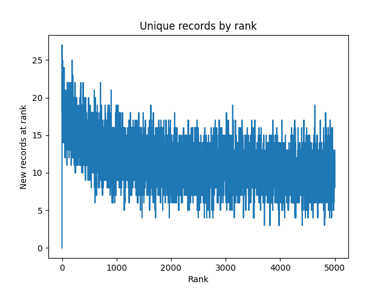
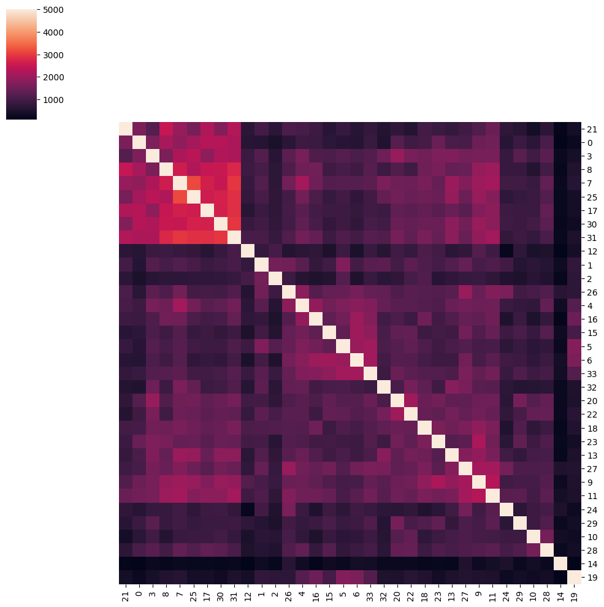

[![CC BY 4.0][cc-by-shield]][cc-by]

# Foras: Semantic Search in OpenAlex
Create datasets for the FORAS project using OpenAlex

## Downloading the OpenAlex data
To download the OpenAlex data on works, run `python foras/download_data.py` from the
root of the repository. This will download all the files and put them in a directory
called `data`. Note that this is approximately 330GB of data (October 2023 snapshot).

## Pre-existing OpenAlex embeddings
There are no suitable pre-existing OpenAlex embeddings.
The only openly available set of OpenAlex embeddings I could find was here:
https://github.com/colonelwatch/abstracts-search/
They used the 'all-MiniLM-L6-v2' sentence-transformers model. This model is purely
English, so at least we need different embeddings for the multilingual embeddings.
Moreover there are better purely english models available (the chosen model is faster).
Finally it looks like only the first 128 tokens were used to create the embeddings.
Using the maximum possible 512 tokens should give better results. 

## Choosing an embedding model
I checked the [MTEB Leaderboard](https://huggingface.co/spaces/mteb/leaderboard),
looking at the subset of models that has 'multilingual' in the name. The best performing
models for the Semantic Text Similarity (STS) category were:
- https://huggingface.co/intfloat/multilingual-e5-large with 1024-D vectors
- https://huggingface.co/sentence-transformers/paraphrase-multilingual-mpnet-base-v2 with 768-D vectors
- https://huggingface.co/intfloat/multilingual-e5-small with 384-D vectors
Here I ignored models that were not open source, or at first sight not compatible with
the sentence_transformers package, or that only support a small set of languages.

In local testing, processing with the smallest model took ~3h per file of 850MB,
the medium model ~9h and for the largest model I had to lower the encoding batch size,
when the process would take ~21h.

## Starting the application
- Make sure that Docker is installed
- Create a file `.env` in the root of the repository and copy the contents of `.env.example`. Fill in the desired values. 
    - `PORT`: Port on which the database will listen to queries.
    - `ADMIN_PORT`: Port where the database listens to admin operations.
    - `DATA_DIR`: This directory will be used to store the data downloaded from OpenAlex and the files created after processing this data.
    - `MOUNT_DIR`: This can be the absolute path to the `mount` directory in this repository, or any other preferred directory. There will be two directories mounted on the container, `$MOUNT_DIR/var` and `$MOUNT_DIR/logs`, which will contain the database and the database logs. Make sure this directory is owned by user/group `1000:1000`.
    - `VESPA_VERSION`: Which version of Vespa to use.
- From the root of the repository run `docker compose up -d`. This starts the container.
- Run `docker exec foras-vespa-1 vespa deploy /srv/app`. This will deploy the database.

Now the database is ready for feeding or querying.

## Size of the vectorized dataset.
Total records in OpenAlex: 246M
Records with publication_year >= 2015: 85M
Records with abstract: 126M
Records with abstract and publication_year >= 2015: 49M

## Feeding
To feed the identifiers and embeddings to the application, set the `VESPA_IP` environment variable in `.env` and run `python foras/feed_data.py`.

## Getting the original dataset
- `python -m synergy_dataset get -d van_de_Schoot_2018 -o $DATA_DIR/synergy -v 'doi,title,abstract,id` and say yes to converting inverted abstract to plaintext. Here `$DATA_DIR` should be be replaced by the same path as in `.env`.

## Citations dataset
The script `foras/find_citations.py` can be used to get a dataset containing the works in OpenAlex that directly reference one of the included records in the original dataset, or the works that reference one of the directly referencing works. It needs two variables from the `.env` file:
- `DATA_DIR`: The directory where to put the dataset. It will end up at `$DATA_DIR/citations.csv`.
- `OPENALEX_EMAIL`: Optional, used in `find_citations.py`. Email adress to send along with API calls to OpenAlex. See: https://docs.openalex.org/how-to-use-the-api/rate-limits-and-authentication#the-polite-pool

In short, what the script does is:
- Read the original dataset (the `van_de_Schoot_2018` dataset from Synergy)
- Mark the records with the following 4 DOI's as excluded:
    - "10.1037/a0020809"
    - "10.1097/BCR.0b013e3181cb8ee6"
    - "10.1007/s00520-015-2960-x"
    - "10.1016/j.pain.2010.02.013"
- For each of the included works, collect all works in OpenAlex that reference to it, and mark them as `primary`.
- For each of the primary records, collect all works in OpenAlex that reference to it, and mark them as `secondary`.
- Combine this into a single CSV file.
- Deduplicate based on the OpenAlex identifier and remove all records that were already present in the original dataset.

This CSV file has the columns:
- `id`: OpenAlex identifier.
- `doi`
- `title`
- `abstract`
- `referenced_works`: List of OpenAlex identifiers.
- `publication_date`
- `level`: Can have two values:
    - `primary`: Directly references one of the included works of the original dataset.
    - `secondary`: References one of the works in the set of primary records.

For the `van_de_Schoot_2018` dataset this gives the following numbers at the time of writing (2023-18-12):

|        | Total | Primary | Secondary |
|--------|-------|---------|-----------|
| All    | 9016  | 465     | 8551      |
| >=2015 | 8682  | 451     | 8231      |

## Semantic Similarity Dataset
### Querying the database
The script `foras/query_database.py` can be used to query the vector database. It needs the following values from the `.env` file:
- `VESPA_IP`: The ip-adress of the Vespa server.
- `PORT`: The port on which the Vespa server is listening to queries.
- `DATA_DIR`: The directory where to put the generated datasets.

What the script does is:
- Vectorize the included records of the original dataset, excluding 4 records (see the section on the citations dataset).
- Query the database using each of these vectors and get the first 5000 results.
- Save the responses together in one file: `included_records_response.parquet`
- Vectorize the inclusion criteria (see https://www.crd.york.ac.uk/prospero/display_record.php?RecordID=494027, section 'Types of study to be included').
- Query the database using this vector and get the first 5000 results.
- Save the response in the file: `inclusion_criteria_response.parquet`

The dataset `included_records_response.parquet` consists of 170000 records (5000 for each of the 34 included records), with the columns:
- `query_id`: The full URL OpenAlex identifier of the query record.
- `rank`: The rank of the response record (0 is the first result, 4999 the last).
- `id`: The short OpenAlex identifier of the response record
- `embedding`: The embedding of the response record. This is a list of 384 floats.
The dataset `inclusion_criteria_response.parquet` has the same columns except the `query_id` column.

### Exploratory data analysis
Some exploratory data analysis, done in the script `foras/data_exploration.py`.
- Out of the 170000 records in `include_records_response.parquet`, there are 57232 unique records. So many records occur in the response for multiple queries.
- You can see how many new records you get when using the top `N+1` ranked instead of the top `N` ranked records. That gives the following picture:

- You can see how much overlap there exists between the responses when querying with different records. That gives the following picture:

- If you include the top 427 of every record, you get exactly 7000 unique records.
- If you include the top 10*427 of every record you get 50055 unique records.

- `included_records_response.parquet` contains 4173 out of 5000 records of `inclusion_criteria_response.parquet`.
- `included_records.response.parquet` contains 2871 our of 9016 records of `citations.csv` and 281 out of 465 primary citations.
- `included_records_response.parquet` contains 315 records from the original dataset.

## License

This work is licensed under a
[Creative Commons Attribution 4.0 International License][cc-by].

[![CC BY 4.0][cc-by-image]][cc-by]

[cc-by]: http://creativecommons.org/licenses/by/4.0/
[cc-by-image]: https://i.creativecommons.org/l/by/4.0/88x31.png
[cc-by-shield]: https://img.shields.io/badge/License-CC%20BY%204.0-lightgrey.svg
